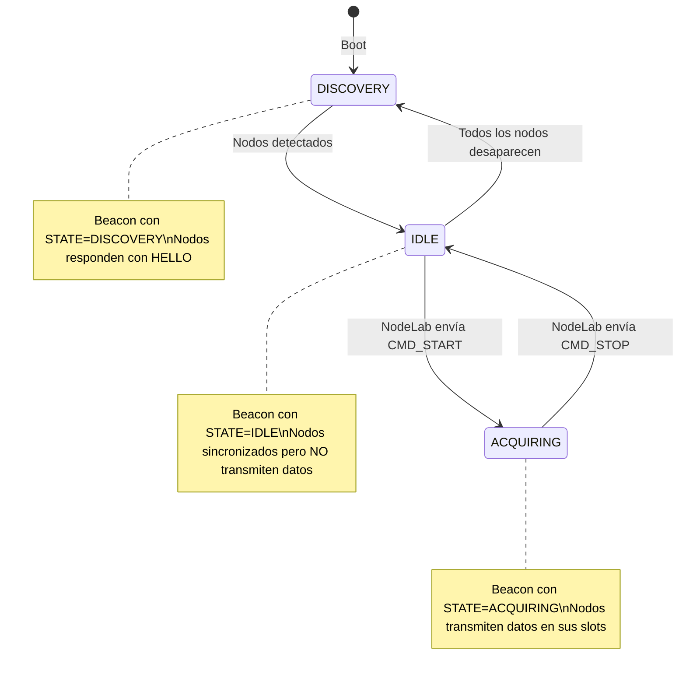

# Rediseño del Protocolo TDMA v4 — Multi-canal, RTC, Start/Stop, Timing Eficiente

## Contexto

Evolución del protocolo TDMA v3 → v4 con cambios fundamentales en:
- Soporte multi-canal (hasta 4 sensores por nodo)
- Sincronización RTC vía beacon
- Control START/STOP desde NodeLab → Base Station → Nodos
- TDMA adaptativo round-robin (sin slots muertos)
- Formato de datos optimizado: `t0 + dt + índice` en lugar de timestamp por muestra

---

## User Review Required

> [!IMPORTANT]
> **Frecuencia de muestreo**: El código actual simula a 100 Hz. ¿Cuál será la frecuencia real de adquisición? Esto afecta directamente el throughput requerido y el diseño del paquete. Los cálculos de abajo asumen **100 Hz por canal** como baseline.

> [!IMPORTANT]
> **RTC del nodo**: ¿Qué módulo RTC usan los nodos? (ej: DS3231, RV-3028, PCF8563). Esto afecta la precisión del timestamp y cómo se lee la hora. Para el protocolo solo necesito saber la resolución (ms vs µs) — el código del driver RTC se puede agregar después.

> [!WARNING]
> **Compatibilidad**: Este cambio es PROTOCOL_VERSION = 4, incompatible con v3. Los 3 componentes (Base Station, Nodos, NodeLab) deben actualizarse juntos. No se puede hacer parcial.

---

## Open Questions

> [!IMPORTANT]
> **¿El Base Station tiene RTC propio?** O ¿usa la hora del PC vía NodeLab? Mi propuesta es que NodeLab envíe la hora UTC al Base Station por serial al conectarse, y el Base Station la redistribuya a los nodos vía beacon. Así la cadena es: `PC clock → Base Station → Beacon → Nodos`.

> [!IMPORTANT]
> **Deep Sleep**: ¿Los nodos realmente implementarán deep sleep en esta fase? Si sí, ¿cuál es el trigger de wake-up? (timer periódico, pin externo, etc.) Esto afecta cómo responden al beacon de discovery. Por ahora lo incluyo como estado en el protocolo pero sin implementar el wake-up real.

---

## Diseño del Protocolo v4

### 1. Estados del Sistema



| Estado | Base Station | Nodo | NodeLab |
|---|---|---|---|
| `DISCOVERY` (0) | Envía beacon broadcast, espera HELLO | Si despierto, responde con HELLO + capabilities | Muestra nodos descubiertos |
| `IDLE` (1) | Envía beacon con schedule, NO espera datos | Sincronizado, NO muestrea, puede dormir | Muestra nodos conectados, START habilitado |
| `ACQUIRING` (2) | Envía beacon, recibe/reenvía datos | Muestrea + transmite en slot asignado | Recibe datos, graba CSV, muestra gráficos |

### 2. Comandos Serial (NodeLab → Base Station)

```
CMD_START\n        → Base Station cambia estado a ACQUIRING
CMD_STOP\n         → Base Station cambia estado a IDLE
CMD_SET_TIME,{unix_epoch_ms}\n → Sincroniza RTC del Base Station
```

La Base Station responde:
```
ACK,CMD_START,OK
ACK,CMD_STOP,OK
ACK,CMD_SET_TIME,OK
```

### 3. TDMA Adaptativo Round-Robin

**Regla**: El ciclo SIEMPRE tiene exactamente `MAX_SLOTS = 10` slots. Se llenan con round-robin de los nodos activos.

```
Ejemplo con 4 nodos activos (IDs: 1, 2, 3, 4):
  Slot:  [0] [1] [2] [3] [4] [5] [6] [7] [8] [9]
  Nodo:   1   2   3   4   1   2   3   4   1   2

  → Nodos 1,2 obtienen 3 slots/ciclo = 3 transmisiones/segundo
  → Nodos 3,4 obtienen 2 slots/ciclo = 2 transmisiones/segundo

Ejemplo con 1 nodo activo (ID: 1):
  Slot:  [0] [1] [2] [3] [4] [5] [6] [7] [8] [9]
  Nodo:   1   1   1   1   1   1   1   1   1   1

  → Nodo 1 obtiene 10 slots/ciclo = máximo throughput

Ejemplo con 10 nodos:
  Slot:  [0] [1] [2] [3] [4] [5] [6] [7] [8] [9]
  Nodo:   1   2   3   4   5   6   7   8   9  10

  → Cada nodo obtiene exactamente 1 slot/ciclo
```

**Timing por slot**:
```
slot_us = (CYCLE_MS * 1000 - REGISTRATION_WINDOW_MS * 1000) / MAX_SLOTS
        = (1000000 - 120000) / 10
        = 88000 µs = 88 ms por slot
```

Un ESP-NOW frame tarda ~1-3 ms. Con 88 ms por slot, un nodo podría enviar **múltiples paquetes** por slot si tiene datos acumulados de varios canales.

### 4. Formato de Datos Optimizado (t0 + dt)

**Concepto**: En vez de enviar un timestamp por cada muestra, solo se envía:
- `t0_epoch_ms` — Hora RTC absoluta (Unix ms) del sample index 0
- `dt_us` — Periodo de muestreo en µs (ej: 10000 µs para 100 Hz)
- `first_sample_index` — Índice global de la primera muestra del paquete

**Reconstrucción en PC**:
```python
sample_time[i] = t0_epoch_ms + (first_sample_index + i) * dt_us / 1000.0
```

**¿Cuándo se envía t0 y dt?** Dos opciones:

**Opción A — Paquete TIMING_INFO separado** *(recomendada)*
- El nodo envía un `PKT_TIMING_INFO` al inicio de la adquisición y cada N segundos
- Los paquetes `PKT_DATA` solo llevan `first_sample_index` + muestras crudas
- Pro: paquetes DATA más pequeños = más muestras por paquete
- Con: si se pierde el TIMING_INFO, hay que esperar al siguiente

**Opción B — t0/dt embebido en cada paquete DATA**
- Cada DATA incluye `t0_epoch_ms` (8 bytes) + `dt_us` (4 bytes)
- Pro: auto-contenido, nunca se pierde contexto
- Con: 12 bytes extra por paquete = ~6 muestras menos por paquete

**Mi recomendación**: **Opción A** con retransmisión periódica (cada 5 segundos). El TIMING_INFO se envía:
1. Al iniciar adquisición (primer slot tras CMD_START)
2. Cada 5 segundos como heartbeat
3. Cuando el Base Station lo solicite vía ACK con flag

### 5. Multi-Canal (hasta 4 canales por nodo)

Cada nodo declara sus canales activos en el `NodeHelloPacket` con un `channel_mask` (4 bits).

**Para los paquetes DATA**: cada paquete lleva un solo canal (`channel_id` 0-3). Con el TDMA round-robin dando múltiples slots por ciclo, un nodo envía canal 0 en slot A, canal 1 en slot B, etc.

**Cálculo de throughput** (4 nodos, 4 canales, 100 Hz):
- Slots por nodo por ciclo: 10/4 ≈ 2.5 (promedio)
- Bytes disponibles por paquete: 250 - 14 (header) = 236 bytes = 118 muestras int16
- Muestras por segundo por nodo: 2.5 slots × 118 = 295 muestras/s
- Requerido: 4 canales × 100 Hz = 400 muestras/s ❌

> [!WARNING]
> **Con 4 nodos × 4 canales × 100Hz, el throughput no alcanza en un ciclo de 1000ms.**
> Soluciones posibles:
> 1. **Reducir CYCLE_MS a 500ms** → duplica los slots/segundo → 590 samples/s/nodo ✅
> 2. **Enviar múltiples paquetes por slot** → slot es 88ms, ESP-NOW toma ~3ms → caben ~25 paquetes por slot
> 3. **Interleave canales** en un solo paquete → 236/4 = 59 time points × 4ch = 236 muestras OK
>
> **Propuesta**: Usar opción 2 (burst dentro de un slot) o reducir CYCLE_MS. ¿Preferencia?

### 6. Structs Propuestos (v4)

```cpp
constexpr uint8_t PROTOCOL_VERSION = 4;
constexpr uint8_t MAX_NODES = 10;
constexpr uint8_t MAX_SLOTS = 10;  // Siempre 10 slots
constexpr uint8_t MAX_CHANNELS_PER_NODE = 4;

enum SystemState : uint8_t {
    STATE_DISCOVERY  = 0,
    STATE_IDLE       = 1,
    STATE_ACQUIRING  = 2,
};

enum PacketType : uint8_t {
    PKT_BEACON_SYNC  = 0x11,
    PKT_NODE_HELLO   = 0x12,
    PKT_DATA         = 0x13,
    PKT_DIRECT_ACK   = 0x14,
    PKT_TIMING_INFO  = 0x15,  // NUEVO
    PKT_CMD          = 0x16,  // NUEVO (gateway → nodo, para START/STOP)
};
```

#### BeaconSyncPacket (v4)
```cpp
typedef struct __attribute__((packed)) {
    uint8_t  type;              // PKT_BEACON_SYNC
    uint8_t  version;           // 4
    uint8_t  system_state;      // STATE_DISCOVERY / IDLE / ACQUIRING
    uint8_t  active_nodes;
    uint16_t cycle_ms;
    uint16_t slot_us;           // Fijo: (cycle - reg_window) / MAX_SLOTS
    uint16_t slot_guard_us;
    uint16_t registration_window_ms;
    uint32_t beacon_sequence;
    uint64_t rtc_epoch_ms;      // NUEVO: hora UTC del gateway (Unix ms)
    uint8_t  slot_schedule[MAX_SLOTS];  // Round-robin: qué nodo en cada slot
    BeaconAckEntry ack_map[MAX_NODES];
} BeaconSyncPacket;
// Tamaño: 4+2+2+2+2+4+8+10+40 = 74 bytes (cabe en 250)
```

#### NodeHelloPacket (v4)
```cpp
typedef struct __attribute__((packed)) {
    uint8_t  type;              // PKT_NODE_HELLO
    uint8_t  version;
    uint8_t  node_id;
    uint8_t  channel_mask;      // Bit 0-3: canales activos (ej: 0x0F = 4 canales)
    uint8_t  channel_count;     // Número de canales activos (1-4)
    uint8_t  flags;             // Bit 0: has_rtc, Bit 1: supports_deep_sleep
    uint16_t sample_rate_hz;    // NUEVO: frecuencia de muestreo declarada
} NodeHelloPacket;
// Tamaño: 8 bytes
```

#### TimingInfoPacket (NUEVO)
```cpp
typedef struct __attribute__((packed)) {
    uint8_t  type;              // PKT_TIMING_INFO
    uint8_t  version;
    uint8_t  node_id;
    uint8_t  channel_id;        // Canal al que aplica este timing (o 0xFF = todos)
    uint32_t sample_rate_hz;    // Frecuencia exacta (ej: 100)
    uint32_t dt_us;             // Periodo en µs (ej: 10000)
    uint64_t t0_epoch_ms;       // Hora UTC del sample index 0 (Unix ms)
    uint32_t t0_sample_index;   // Índice del sample correspondiente a t0
} TimingInfoPacket;
// Tamaño: 24 bytes
```

#### DataPacketHeader (v4)
```cpp
typedef struct __attribute__((packed)) {
    uint8_t  type;              // PKT_DATA
    uint8_t  version;
    uint8_t  node_id;
    uint8_t  channel_id;        // NUEVO: qué canal (0-3)
    uint16_t sequence_id;
    uint16_t sample_count;
    uint32_t first_sample_index;// NUEVO: reemplaza node_timestamp_us
} DataPacketHeader;
// Tamaño: 12 bytes (igual que v3, pero sin timestamp)
// Payload max: 250 - 12 = 238 bytes = 119 muestras int16
```

### 7. Formato Serial Actualizado (v4)

```
# Timing info (nuevo)
TIMING,{node_id},{ch_id},{sample_rate_hz},{dt_us},{t0_epoch_ms},{t0_sample_index}

# Data (cambia: channel_id reemplaza gw_rx_us, first_sample_index reemplaza node_ts_us)
DATA_INT16,{node_id},{ch_id},{seq},{first_sample_index},{val1},{val2},...

# Beacon (agrega system_state y rtc_epoch_ms)
BEACON,{seq},STATE={state},NODES={n},SLOT_US={us},RTC={epoch_ms},SCHED={id;id;...},ACKS={id:seq;...}

# Hello (agrega capabilities)
HELLO,{node_id},{mac},CH={channel_mask},RATE={sample_rate_hz}

# Nuevo: respuesta a comandos
ACK,{command},{result}

# El resto igual (NODE_JOIN, NODE_TIMEOUT, LOSS, STATS, BOOT, WARN)
```

---

## Proposed Changes

### Componente 1: shared/tdma_protocol.h

#### [MODIFY] [tdma_protocol.h](file:///c:/Users/Becario%204/Documents/PlatformIO/Projects/ESP_Network_Suite/shared/tdma_protocol.h)
- Bump `PROTOCOL_VERSION` a 4
- Agregar constantes: `MAX_SLOTS`, `MAX_CHANNELS_PER_NODE`
- Agregar enum `SystemState`
- Agregar `PKT_TIMING_INFO`, `PKT_CMD` a `PacketType`
- Rediseñar `BeaconSyncPacket` con `system_state`, `rtc_epoch_ms`, `slot_schedule[10]`
- Rediseñar `NodeHelloPacket` con `channel_mask`, `sample_rate_hz`
- Agregar `TimingInfoPacket`
- Rediseñar `DataPacketHeader` con `channel_id`, `first_sample_index` (sin `node_timestamp_us`)
- Agregar función `buildRoundRobinSchedule()`
- Recalcular `computeSlotUs()` como constante: `(CYCLE_MS*1000 - REG_WINDOW*1000) / MAX_SLOTS`

---

### Componente 2: Comunicacion_ESPNOW (Base Station)

#### [MODIFY] [main.cpp](file:///c:/Users/Becario%204/Documents/PlatformIO/Projects/ESP_Network_Suite/Comunicacion_ESPNOW/src/main.cpp)
- **State machine**: Reemplazar `BROADCASTING_BEACON/REGISTRATION_WINDOW/WAITING_SLOTS` con `DISCOVERY/IDLE/ACQUIRING`
- **Serial commands**: Agregar parsing de `CMD_START\n`, `CMD_STOP\n`, `CMD_SET_TIME,{ms}\n` desde el puerto serie
- **Beacon**: Incluir `system_state`, `rtc_epoch_ms`, `slot_schedule[10]` con round-robin
- **NodeHelloPacket**: Guardar `channel_mask` y `sample_rate_hz` en `ActiveNodeEntry`
- **TIMING_INFO handling**: Recibir PKT_TIMING_INFO de nodos y reenviarlo por serial
- **Data handling**: Usar nuevo `DataPacketHeader` con `channel_id` + `first_sample_index`
- **emitPayloadCsv()**: Formato actualizado `DATA_INT16,node_id,ch_id,seq,first_idx,vals...`
- **Schedule**: `rebuildSchedule()` usa round-robin para llenar 10 slots

---

### Componente 3: Sender_ESPNOW (Nodos)

#### [MODIFY] [main.cpp](file:///c:/Users/Becario%204/Documents/PlatformIO/Projects/ESP_Network_Suite/Sender_ESPNOW/src/main.cpp)
- **State machine**: Nuevo flujo: escuchar beacon → enviar HELLO → esperar STATE_ACQUIRING → muestrear + transmitir
- **Multi-canal**: `NUM_CHANNELS` configurable (1-4), ring buffer por canal
- **HELLO con capabilities**: Enviar `channel_mask` y `sample_rate_hz`
- **TIMING_INFO**: Enviar al inicio de adquisición + cada 5s
- **RTC sync**: Sincronizar reloj local con `rtc_epoch_ms` del beacon
- **Data packets**: Usar `channel_id` + `first_sample_index`, sin timestamp
- **Slot scheduling**: Recibir `slot_schedule[10]` del beacon, contar cuántos slots tiene asignados, distribuir canales entre slots
- **IDLE state**: Cuando beacon dice STATE_IDLE, dejar de muestrear

---

### Componente 4: NodeLab (Desktop App)

#### [MODIFY] [protocol_parser.py](file:///c:/Users/Becario%204/Documents/PlatformIO/Projects/ESP_Network_Suite/NodeLab/esp_sensor_connect/core/protocol_parser.py)
- Agregar `TimingFrame` dataclass
- Actualizar `DataFrame` con `channel_id` y `first_sample_index` (sin `gateway_rx_us`/`node_timestamp_us`)
- Actualizar `BeaconFrame` con `system_state`, `rtc_epoch_ms`, `schedule`
- Actualizar `HelloFrame` con `channel_mask`, `sample_rate_hz`
- Agregar parser para `TIMING,...` lines
- Agregar `AckFrame` parser para `ACK,CMD_START,OK`

#### [MODIFY] [serial_manager.py](file:///c:/Users/Becario%204/Documents/PlatformIO/Projects/ESP_Network_Suite/NodeLab/esp_sensor_connect/core/serial_manager.py)
- `start_acquisition()`: Enviar `CMD_START\n` al Base Station vía serial
- `stop_acquisition()`: Enviar `CMD_STOP\n`
- `sync_time()`: Enviar `CMD_SET_TIME,{unix_ms}\n` al conectar
- Manejar `TimingFrame`: guardar `t0` y `dt` por nodo/canal
- **Reconstrucción temporal**: calcular `sample_time = t0 + (first_sample_index + i) * dt / 1000`
- Agregar info multi-canal al buffer de nodos

#### [MODIFY] [data_logger.py](file:///c:/Users/Becario%204/Documents/PlatformIO/Projects/ESP_Network_Suite/NodeLab/esp_sensor_connect/core/data_logger.py)
- Agregar columna `channel_id` al CSV
- Usar timestamp reconstruido desde t0+dt en lugar de `datetime.now()`

---

## Verification Plan

### Automated Tests
1. `pio run` en ambos firmware → verificar compilación exitosa
2. Test unitario del parser Python con las nuevas tramas v4
3. Verificar que `sizeof(BeaconSyncPacket) <= 250` (límite ESP-NOW)

### Manual Verification
- Simular tramas v4 en el parser y verificar reconstrucción temporal
- Verificar round-robin schedule con diferentes cantidades de nodos
