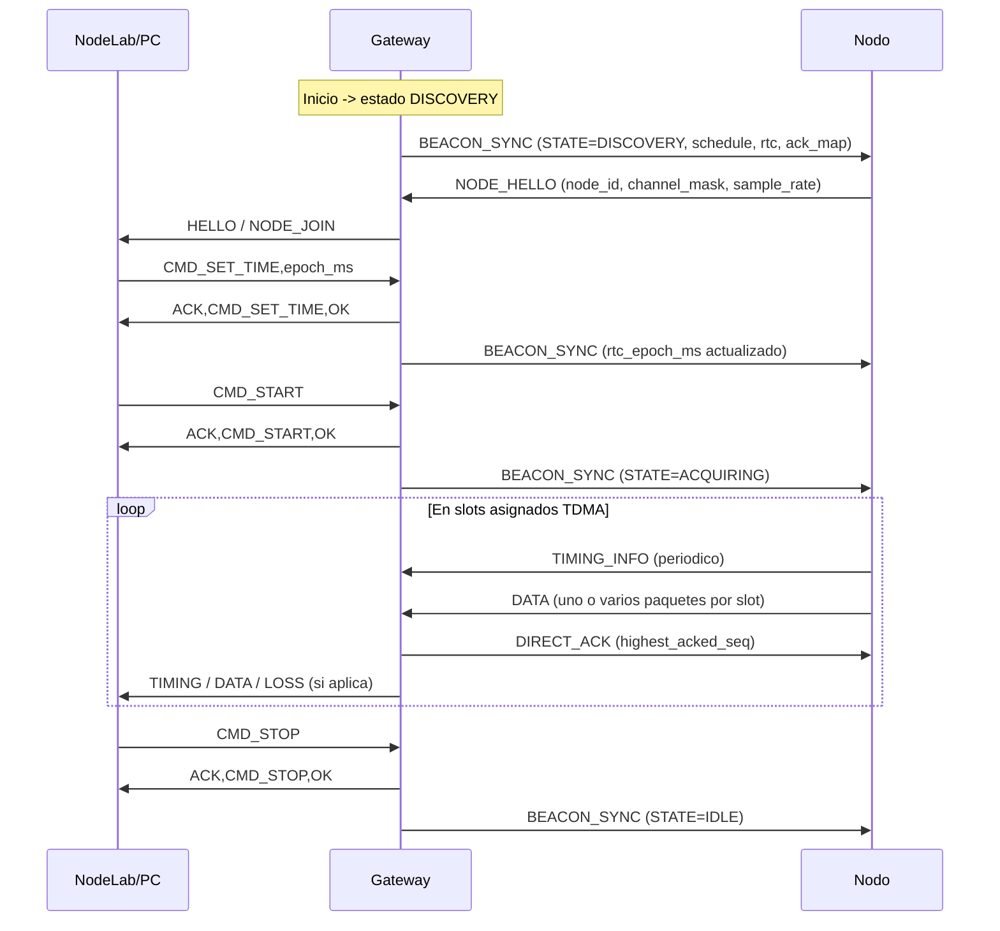
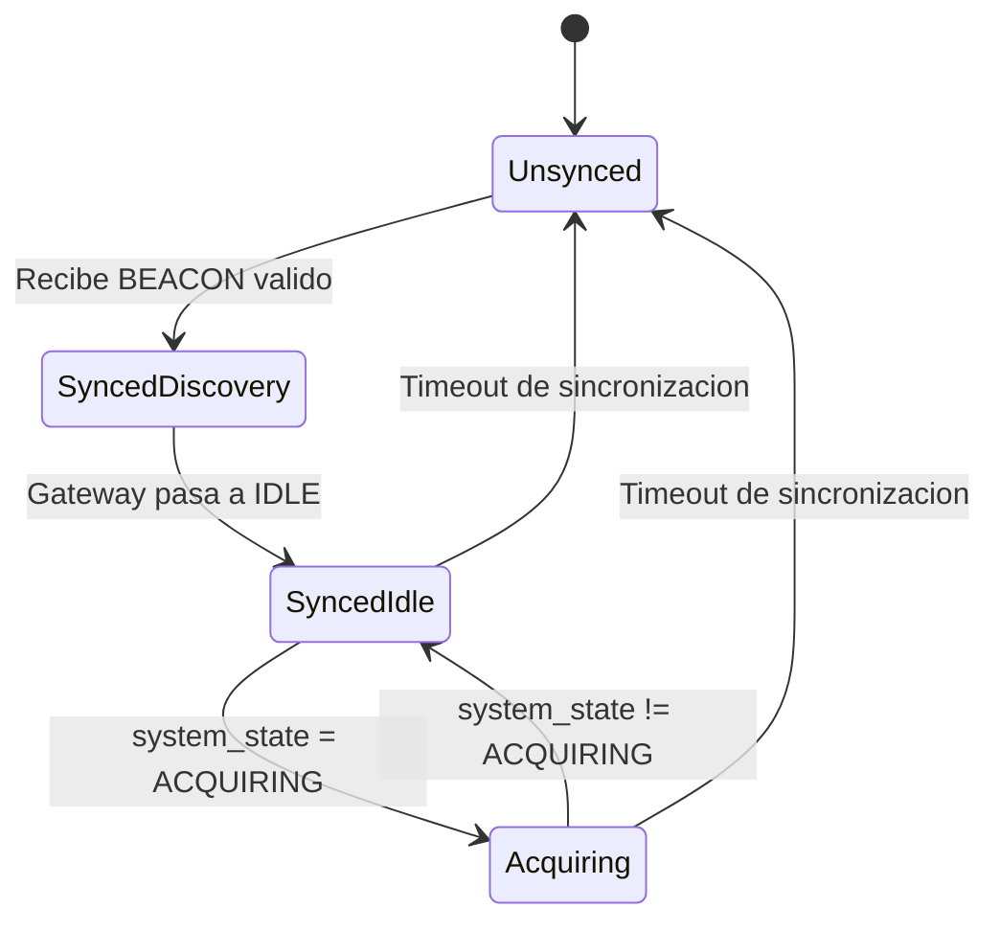

# Protocolo de Comunicacion ESP-NOW/TDMA v4 - Documentacion Oficial

## Ultima actualizacion
- Fecha: 2026-04-21
- Resumen de cambios:
  - Se crea el documento canonico unico del protocolo de comunicacion.
  - Se consolida la especificacion real desde codigo fuente de gateway, nodo y header compartido.
  - Se agregan tablas de paquetes, temporizacion TDMA, maquina de estados, diagramas Mermaid y trazabilidad.
  - Se registran inconsistencias entre documentacion historica y la implementacion vigente.

## 1. Resumen ejecutivo del protocolo
Este sistema implementa una red de sensores basada en ESP-NOW con planificacion TDMA v4 para coordinacion determinista entre un gateway ESP32-C3 y hasta 10 nodos remotos ESP32-C3.

El contrato de datos se define en un header compartido unico y se aplica en dos planos:
- Plano inalambrico (Nodo <-> Gateway): beacons, hello, datos, timing, ack directo.
- Plano serial (Gateway -> PC): lineas CSV/evento que exponen datos, estado, perdidas y telemetria.

Propiedades relevantes de la version vigente:
- Version de protocolo: 4.
- Ciclo TDMA fijo: 1000 ms.
- Ventana de registro: 100 ms.
- Slots por ciclo: 10, asignados por round-robin sobre nodos activos.
- Soporte multi-canal por nodo: hasta 4 canales.
- Sincronizacion temporal eficiente con modelo t0 + dt + sample_index.
- Control de estado desde PC por comandos seriales: START, STOP, SET_TIME, SET_RATE.

## 2. Alcance y supuestos
### Alcance
Este documento cubre exclusivamente la comunicacion de protocolo entre:
- Firmware gateway en Comunicacion_ESPNOW.
- Firmware nodo en Sender_ESPNOW.
- Contrato compartido de datos en shared.
- Contrato serial publicado por gateway.

### Fuera de alcance
- UI y analitica de NodeLab (solo se considera su interfaz serial como consumidor del contrato).
- Logica de negocio de escritorio no ligada al protocolo inalambrico.

### Supuestos operativos
- Canal WiFi/ESP-NOW fijo en 1 para gateway y nodos.
- Todos los nodos usan la misma version de protocolo.
- La red opera sin cifrado ESP-NOW (peer.encrypt = false).

## 3. Arquitectura de comunicacion (roles, flujos, capas)
### 3.1 Roles
- Gateway (Base Station): coordina TDMA, emite beacon global, recibe datos, detecta perdidas, envia ACK directo y reenvia contrato serial al PC.
- Nodo remoto: se sincroniza por beacon, registra capacidades, adquiere muestras, transmite en slots asignados y aplica control lossless por ACK.
- PC/Host: envia comandos de control por serial y consume telemetria estructurada.

### 3.2 Capas logicas
- Capa fisica/enlace: ESP-NOW en 2.4 GHz, canal 1.
- Capa MAC temporal: TDMA por ciclo fijo con 10 slots y ventana inicial de registro.
- Capa de sesion/control: estados DISCOVERY/IDLE/ACQUIRING y comandos CMD_*.
- Capa de datos: DATA con payload por canal, TIMING para reconstruccion temporal, ACK para control de entrega.
- Capa de integracion host: serial CSV/eventos.

### 3.3 Flujo principal


## 4. Especificacion de paquetes y campos
### 4.1 Parametros globales del protocolo
| Parametro | Valor vigente | Fuente |
|---|---:|---|
| PROTOCOL_VERSION | 4 | shared/tdma_protocol.h |
| MAX_NODES | 10 | shared/tdma_protocol.h |
| MAX_SLOTS | 10 | shared/tdma_protocol.h |
| MAX_CHANNELS_PER_NODE | 4 | shared/tdma_protocol.h |
| ESPNOW_MAX_PAYLOAD_BYTES | 250 | shared/tdma_protocol.h |
| CYCLE_MS | 1000 | shared/tdma_protocol.h |
| REGISTRATION_WINDOW_MS | 100 | shared/tdma_protocol.h |
| SLOT_GUARD_US | 200 | shared/tdma_protocol.h |
| SLOT_US derivado | 90000 us | shared/tdma_protocol.h |
| NODE_INACTIVE_TIMEOUT_MS | 10000 | shared/tdma_protocol.h |
| TIMING_INFO_INTERVAL_MS | 5000 | shared/tdma_protocol.h |

### 4.2 Enumeraciones de tipo de paquete
| Tipo | Codigo | Direccion | Estructura |
|---|---|---|---|
| PKT_BEACON_SYNC | 0x11 | Gateway -> Broadcast | BeaconSyncPacket |
| PKT_NODE_HELLO | 0x12 | Nodo -> Gateway | NodeHelloPacket |
| PKT_DATA | 0x13 | Nodo -> Gateway | DataPacketHeader + payload |
| PKT_DIRECT_ACK | 0x14 | Gateway -> Nodo (unicast) | DirectAckPacket |
| PKT_TIMING_INFO | 0x15 | Nodo -> Gateway | TimingInfoPacket |

### 4.3 BeaconSyncPacket (gateway -> broadcast)
Tamano real empaquetado: 78 bytes.

| Campo | Tipo | Bytes | Descripcion |
|---|---|---:|---|
| type | uint8 | 1 | PKT_BEACON_SYNC |
| version | uint8 | 1 | Version de protocolo |
| system_state | uint8 | 1 | Estado global (0,1,2) |
| active_nodes | uint8 | 1 | Cantidad de nodos activos |
| cycle_ms | uint16 | 2 | Duracion de ciclo TDMA |
| slot_us | uint16 | 2 | Duracion de slot |
| slot_guard_us | uint16 | 2 | Guardia entre slots |
| registration_window_ms | uint16 | 2 | Ventana inicial de registro |
| sample_rate_hz | uint16 | 2 | Tasa objetivo publicada por GW |
| reserved_beacon | uint16 | 2 | Reservado |
| beacon_sequence | uint32 | 4 | Secuencia de beacon |
| rtc_epoch_ms | uint64 | 8 | Reloj UTC del gateway |
| slot_schedule | uint8[10] | 10 | Node ID asignado por slot |
| ack_map | BeaconAckEntry[10] | 40 | Ultima secuencia confirmada por nodo |

### 4.4 NodeHelloPacket (nodo -> gateway)
Tamano real: 8 bytes.

| Campo | Tipo | Bytes | Descripcion |
|---|---|---:|---|
| type | uint8 | 1 | PKT_NODE_HELLO |
| version | uint8 | 1 | Version de protocolo |
| node_id | uint8 | 1 | ID de nodo (1..10) |
| channel_mask | uint8 | 1 | Bits de canales activos (0..3) |
| channel_count | uint8 | 1 | Numero de canales activos |
| flags | uint8 | 1 | Capabilities (has_rtc, deep_sleep, etc.) |
| sample_rate_hz | uint16 | 2 | Tasa de muestreo declarada |

### 4.5 DataPacketHeader (nodo -> gateway)
Header fijo: 14 bytes.

| Campo | Tipo | Bytes | Descripcion |
|---|---|---:|---|
| type | uint8 | 1 | PKT_DATA |
| version | uint8 | 1 | Version de protocolo |
| node_id | uint8 | 1 | ID de nodo |
| channel_id | uint8 | 1 | Canal (0..3) |
| sample_encoding | uint8 | 1 | 1=int16, 2=float32 |
| reserved | uint8 | 1 | Reservado |
| sequence_id | uint16 | 2 | Secuencia global del nodo |
| sample_count | uint16 | 2 | Cantidad de muestras en payload |
| first_sample_index | uint32 | 4 | Indice global de la primera muestra |

Capacidad maxima teorica por paquete segun encoding:
- INT16: floor((250 - 14) / 2) = 118 muestras.
- FLOAT32: floor((250 - 14) / 4) = 59 muestras.

Nota de interoperabilidad:
- El nodo actual transmite INT16.
- El gateway acepta INT16 y FLOAT32 al decodificar.

### 4.6 TimingInfoPacket (nodo -> gateway)
Tamano real: 24 bytes.

| Campo | Tipo | Bytes | Descripcion |
|---|---|---:|---|
| type | uint8 | 1 | PKT_TIMING_INFO |
| version | uint8 | 1 | Version de protocolo |
| node_id | uint8 | 1 | ID de nodo |
| channel_id | uint8 | 1 | Canal especifico o 0xFF todos |
| sample_rate_hz | uint32 | 4 | Tasa efectiva |
| dt_us | uint32 | 4 | Periodo de muestreo en us |
| t0_epoch_ms | uint64 | 8 | Tiempo UTC de referencia |
| t0_sample_index | uint32 | 4 | Indice asociado a t0 |

### 4.7 DirectAckPacket (gateway -> nodo unicast)
Tamano real: 10 bytes.

| Campo | Tipo | Bytes | Descripcion |
|---|---|---:|---|
| type | uint8 | 1 | PKT_DIRECT_ACK |
| version | uint8 | 1 | Version de protocolo |
| node_id | uint8 | 1 | Nodo destino |
| system_state | uint8 | 1 | Estado global para sincronizar nodo |
| highest_acked_seq | uint16 | 2 | Secuencia maxima confirmada |
| gateway_rx_us | uint32 | 4 | Timestamp local RX (diagnostico) |

## 5. Temporizacion y sincronizacion
### 5.1 Formula de slot
SLOT_US se deriva en compilacion:

SLOT_US = ((CYCLE_MS * 1000) - (REGISTRATION_WINDOW_MS * 1000)) / MAX_SLOTS

Con valores vigentes:
- CYCLE_MS = 1000
- REGISTRATION_WINDOW_MS = 100
- MAX_SLOTS = 10
- SLOT_US = 90000 us

### 5.2 Ventanas del ciclo
- Ventana de registro: primeros 100 ms del ciclo.
- Ventana de datos: 900 ms restantes repartidos en 10 slots de 90 ms.
- Guard time configurado: 200 us.

### 5.3 Reintentos y control lossless
- El nodo usa buffer circular por canal y tabla inflight para paquetes no confirmados.
- El avance de acked se produce solo al recibir ACK directo o ack_map en beacon.
- Si llega secuencia adelantada, el gateway emite evento LOSS con expected/got.
- Si llega secuencia duplicada, el payload se descarta pero puede re-ACKearse.

### 5.4 Sincronizacion temporal de reloj
Cadena de sincronizacion:
1. PC envia CMD_SET_TIME,epoch_ms al gateway.
2. Gateway actualiza rtc_epoch_ms local.
3. Gateway inserta rtc_epoch_ms en cada beacon.
4. Nodo ajusta su referencia rtc al recibir beacon.
5. Nodo publica TIMING_INFO para reconstruccion de tiempos de muestra en host.

### 5.5 Reconstruccion de tiempo de muestra
Para muestra i dentro de un paquete DATA:

sample_time_ms(i) = t0_epoch_ms + ((first_sample_index + i) * dt_us) / 1000

## 6. Maquina de estados y secuencias clave
### 6.1 Estados de sistema
- STATE_DISCOVERY = 0
- STATE_IDLE = 1
- STATE_ACQUIRING = 2

### 6.2 Diagrama de estados del nodo


### 6.3 Secuencias clave
- Registro:
  - Nodo envia NODE_HELLO durante ventana de registro.
  - Gateway crea entrada de nodo y publica NODE_JOIN/HELLO por serial.
- Inicio de adquisicion:
  - PC envia CMD_START.
  - Gateway confirma ACK,CMD_START,OK y cambia beacons a ACQUIRING.
  - Nodos inician adquisicion al observar estado ACQUIRING.
- Envio de datos:
  - Nodo transmite burst dentro de su slot (hasta BURST_MAX_PKTS_PER_SLOT).
  - Gateway valida tamano/encoding/secuencia y responde DIRECT_ACK.
  - Gateway reenvia DATA y TIMING al host.
- Detencion:
  - PC envia CMD_STOP.
  - Gateway cambia a IDLE y nodos detienen adquisicion.

## 7. Compatibilidad entre nodos/base y versionado de protocolo
### 7.1 Regla de compatibilidad
- Condicion minima de interoperabilidad OTA: version de paquete debe ser igual a PROTOCOL_VERSION (4).
- Cualquier paquete con version distinta se descarta.

### 7.2 Compatibilidad interna observada
- shared/tdma_protocol.h define el contrato canonico.
- Comunicacion_ESPNOW y Sender_ESPNOW incluyen el contrato via redirect en lib/include.
- Ambos firmwares validan version en recepcion.

### 7.3 Incompatibilidad con v3
- V4 no es retrocompatible con v3 por cambios de estados, tipos de paquete y campos de datos/timing.

## 8. Trazabilidad a codigo fuente (archivos y simbolos clave)
| Archivo | Simbolos/zonas clave | Relevancia |
|---|---|---|
| shared/tdma_protocol.h | PROTOCOL_VERSION, PacketType, SystemState, structs Beacon/Hello/Data/Timing/Ack, utilidades de longitud | Contrato OTA canonico |
| Comunicacion_ESPNOW/src/main.cpp | TDMAGateway::processCommand, sendBeaconSync, handleNodeHello, handleDataPacket, handleTimingInfo, sendDirectAck, printStats | Implementacion del gateway y contrato serial |
| Sender_ESPNOW/src/main.cpp | onDataRecv, sendNodeHello, sendTimingInfo, sendDataForChannel, transmitBurstInSlot, inflightProcessAck, startAcquisition/stopAcquisition | Implementacion nodo TDMA + lossless |
| Comunicacion_ESPNOW/lib/tdma_protocol.h | Redirect a shared | Consistencia de include path |
| Sender_ESPNOW/lib/tdma_protocol.h | Redirect a shared | Consistencia de include path |
| README.md | Resumen general del repo | Contiene datos historicos no totalmente alineados |
| SYSTEM_ARCHITECTURE.md | Contrato funcional de alto nivel | Cercano a v4, pero con al menos un tamano de paquete desalineado |

## 9. Riesgos tecnicos, limites y recomendaciones
### 9.1 Riesgos detectados
- Divergencia documental:
  - README.md aun describe protocolo v3 y parametros no vigentes (ejemplo: REG=120 ms, timeout=5000 ms).
  - SYSTEM_ARCHITECTURE.md lista BeaconSyncPacket con 74B, mientras el header vigente define 78B.
- Cifrado deshabilitado en peers ESP-NOW (encrypt=false) en nodo y gateway.
- Rendimiento real en campo no documentado con mediciones de jitter/perdida por carga maxima multicanal.

### 9.2 Limites funcionales actuales
- MAX_NODES fijo en 10.
- MAX_CHANNELS_PER_NODE fijo en 4.
- El nodo implementado envia datos en INT16; FLOAT32 queda soportado a nivel de contrato pero no activado en transmision actual.
- El timeout de sincronizacion en nodo depende de multiples ciclos sin beacon (SYNC_TIMEOUT_CYCLES).

### 9.3 Recomendaciones
1. Alinear README.md y SYSTEM_ARCHITECTURE.md con este documento canonico para evitar errores de integracion.
2. Registrar pruebas de capacidad con matriz: nodos x canales x sample_rate para establecer limites operativos validados.
3. Definir politica de seguridad de enlace (cifrado ESP-NOW, rotacion de peers, control de origen).
4. Versionar cambios de protocolo con semver explicito y pruebas de compatibilidad por release.

## 10. Anexos tecnicos
### 10.1 Glosario
- TDMA: Time Division Multiple Access, reparto temporal de canal en slots.
- Beacon: paquete periodico del gateway que sincroniza estado y agenda de slots.
- Slot schedule: arreglo de 10 entradas que asigna node_id por slot.
- ACK directo: confirmacion unicast del gateway con secuencia maxima confirmada.
- t0 + dt: modelo de tiempo donde t0 es referencia absoluta y dt el periodo entre muestras.

### 10.2 Tabla de constantes relevantes
| Constante | Valor |
|---|---:|
| MAX_NODES | 10 |
| MAX_SLOTS | 10 |
| MAX_CHANNELS_PER_NODE | 4 |
| CYCLE_MS | 1000 |
| REGISTRATION_WINDOW_MS | 100 |
| SLOT_US | 90000 |
| SLOT_GUARD_US | 200 |
| NODE_INACTIVE_TIMEOUT_MS | 10000 |
| TIMING_INFO_INTERVAL_MS | 5000 |
| BURST_MAX_PKTS_PER_SLOT (nodo) | 12 |
| SAMPLE_RING_CAPACITY (nodo, por canal) | 4096 |
| INFLIGHT_CAPACITY (nodo) | 48 |

### 10.3 Ejemplos de payload/lineas serial
Ejemplo de DATA (INT16):
```text
DATA,1,2,345,1,12000,4,2031,2035,2042,2037
```
Interpretacion:
- node_id=1
- channel_id=2
- seq=345
- encoding=1 (INT16)
- first_sample_index=12000
- sample_count=4
- muestras=[2031,2035,2042,2037]

Ejemplo de TIMING:
```text
TIMING,1,255,1000,1000,1713685000123,0
```
Interpretacion:
- node_id=1
- channel_id=255 (aplica a todos)
- sample_rate_hz=1000
- dt_us=1000
- t0_epoch_ms=1713685000123
- t0_sample_index=0

Ejemplo de BEACON serial:
```text
BEACON,88,STATE=2,NODES=3,SLOT_US=90000,RTC=1713685000456,SCHED=1;2;3;1;2;3;1;2;3;1,ACKS=1:344;2:120;3:98
```

## Pendientes de confirmacion
- Fuente de reloj de referencia de produccion para CMD_SET_TIME (sincronizacion UTC del host): Pendiente de confirmacion.
- Politica oficial de seguridad/cifrado ESP-NOW para despliegue industrial: Pendiente de confirmacion.
- Curvas de rendimiento medidas en hardware real bajo carga maxima multicanal: Pendiente de confirmacion.
- Contrato final esperado de NodeLab para parseo de todos los eventos seriales en v4: Pendiente de confirmacion.

## Control de cambios por version
| Version protocolo | Fecha | Origen del cambio | Secciones afectadas | Resumen tecnico | Estado |
|---|---|---|---|---|---|
| 4.0.0 | 2026-04-21 | shared/tdma_protocol.h, Comunicacion_ESPNOW/src/main.cpp, Sender_ESPNOW/src/main.cpp, README.md, SYSTEM_ARCHITECTURE.md | Documento completo inicial | Se consolida especificacion v4 vigente desde codigo, incluyendo paquetes, timing, estados, trazabilidad y hallazgos de divergencia documental | vigente |
